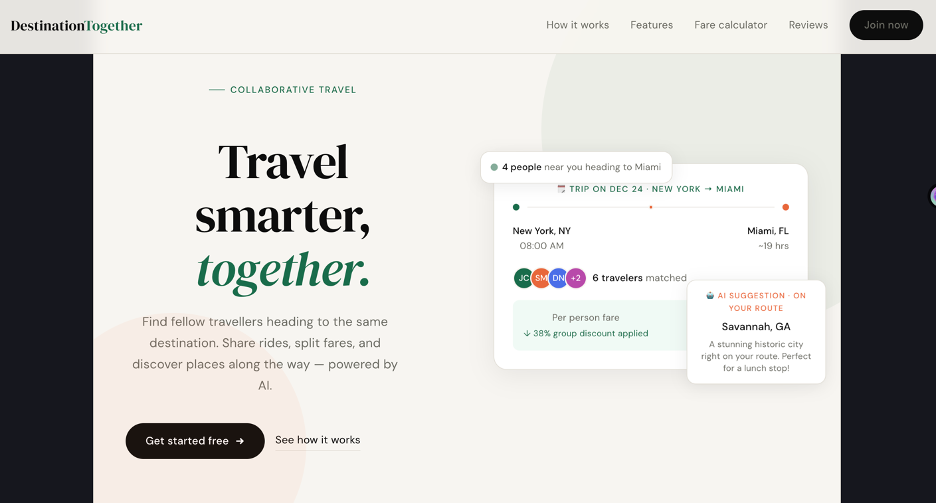
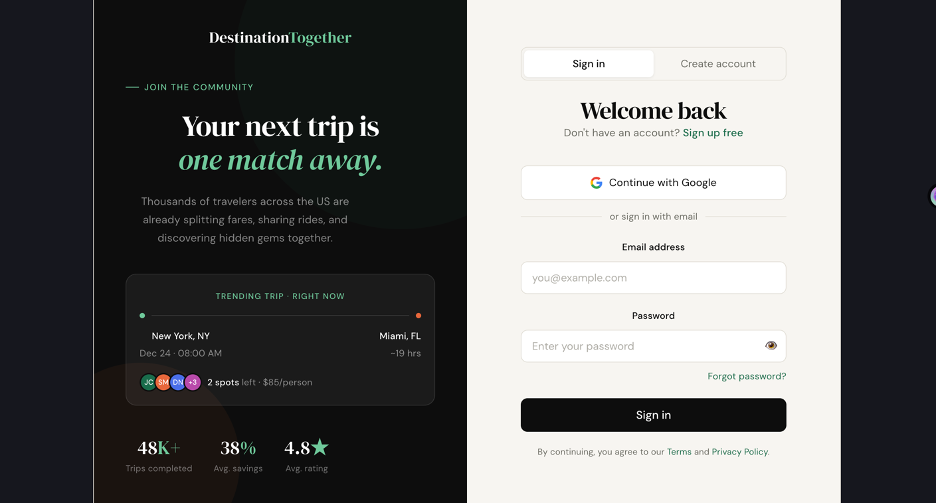
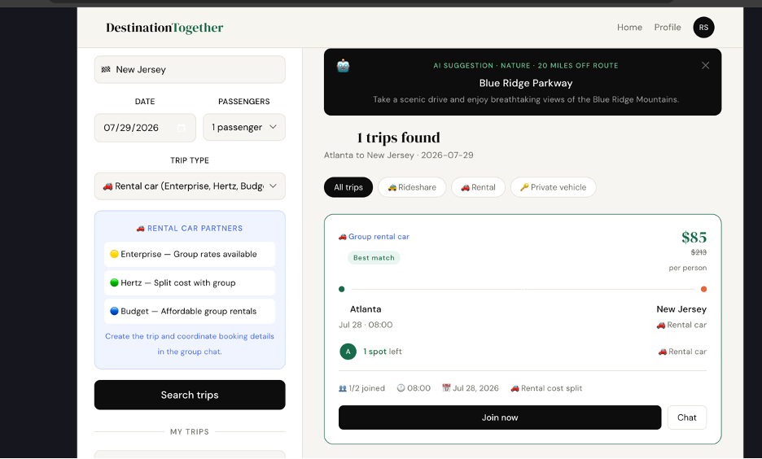
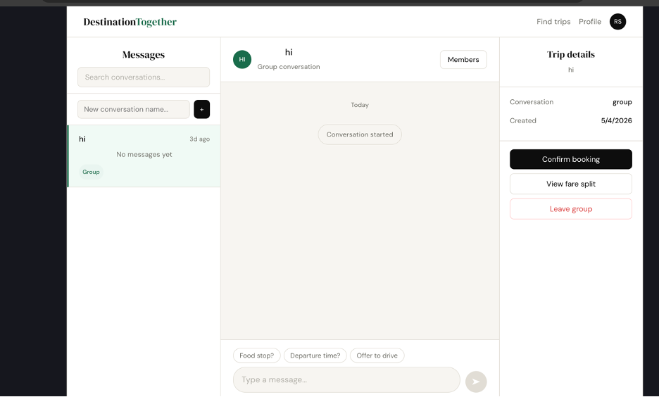
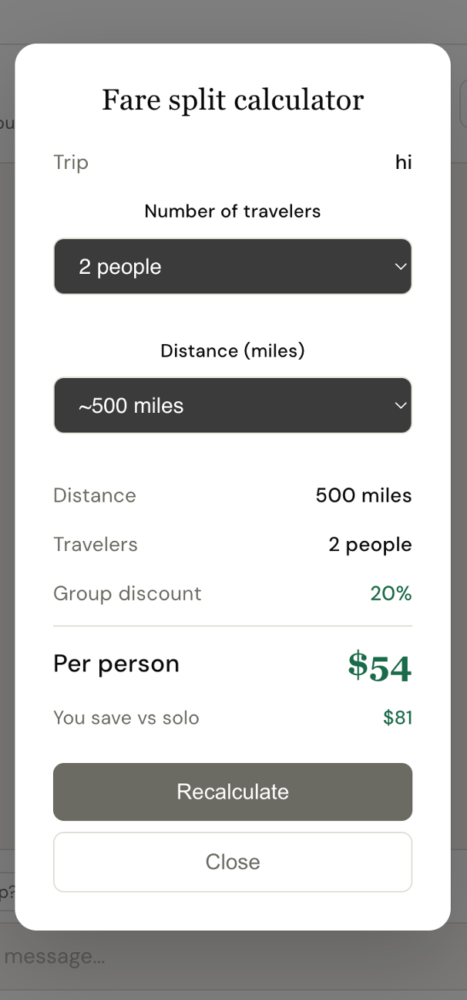

# Destination Together

A full-stack collaborative travel web application that helps travelers in the United States find others heading the same route, split fares, coordinate via group chat, and pay each other directly using Venmo or Zelle. Powered by **Groq AI** for real-time route suggestions.

**Tech Stack:** React · Node.js · PostgreSQL · Docker · Groq AI (Llama 3) · JWT · Socket.io · Nginx

---

## App Screenshots

### Landing Page


The landing page shows a live trip card previewing a matched group heading from New York to Miami with an AI suggestion panel. Users can see real-time group discounts and available spots before signing up.

---

### Login and Register


Two-tab authentication page with JWT-based login and a 2-step registration flow. Includes Google OAuth button, password strength meter, and a live trending trip card on the left panel showing real data from the database.

---

### Trip Planning with AI Suggestions


The core trip discovery page. Search by origin, destination, and date across three trip types — Rideshare, Rental car (Enterprise / Hertz / Budget), or Private vehicle. The black banner at the top shows a **real-time AI suggestion** powered by Groq (Llama 3) — in this screenshot it recommended the Blue Ridge Parkway as a scenic detour 20 miles off the Atlanta to New Jersey route.

---

### Group Chat


Three-column messaging interface with conversation list, real-time chat area, and a trip details panel on the right. Features quick reply buttons (Food stop? Departure time? Offer to drive), fare split calculator access, confirm booking, and leave group actions.

---

### Fare Split Calculator


AI-powered fare split modal accessible from the chat page. Select the number of travelers and distance — the calculator calls the Fare Service API and returns the per-person cost, group discount percentage, and total savings vs traveling solo. In this example 2 people splitting a 500-mile trip pay $54 each, saving $81 vs solo.

---

## Architecture

```
React Frontend (Port 80 via Nginx)
         |
    API Gateway (Port 4000) — JWT Auth + Request Routing
         |
  -------------------------------------------------------
  |          |          |         |             |
User      Trip        Fare      Chat           AI
Service   Service    Service   Service       Service
(4001)    (4002)     (4003)    (4004)        (4005)
  |          |          |         |
  -------------------------------------------------------
                    |
             PostgreSQL Database
```

**8 Docker containers** — start everything with one command.

---

## Features

- JWT authentication — register and login with secure token storage
- Trip search with partial city name matching across 3 trip types
- Real-time AI route suggestions powered by Groq (Llama 3.1)
- Group chat with Socket.io and REST polling fallback
- Fare split calculator with group discounts up to 50% off
- Venmo deep-link and Zelle payment flow for private vehicle trips
- Full Docker Compose deployment — one command to run everything

---

## How to Run Locally

**Requirements:** Docker Desktop installed and running

**Step 1 — Clone the repo**
```bash
git clone https://github.com/raghava7261/destination-together.git
cd destination-together
```

**Step 2 — Add your Groq API key**

Get a free key at https://console.groq.com (no credit card needed)

```bash
echo "GROQ_API_KEY=your_key_here" > .env
```

**Step 3 — Start all 8 services**
```bash
docker-compose up -d
```

**Step 4 — Open the app**

Open http://localhost in your browser.

**Step 5 — Register and test**

Go to http://localhost/login and create a new account. Then search for a trip from Atlanta to New York — the AI suggestion will appear automatically.

**To stop everything**
```bash
docker-compose down
```

---

## API Endpoints

| Method | Endpoint | Description |
|--------|----------|-------------|
| POST | /api/auth/register | Create account, returns JWT |
| POST | /api/auth/login | Login, returns JWT |
| GET | /api/trips/search | Search trips by route and date |
| POST | /api/trips | Create a new trip |
| POST | /api/trips/:id/join | Join a trip |
| GET | /api/trips/my | Get all user trips |
| POST | /api/fare/calculate | Calculate fare split |
| POST | /api/chat | Create conversation |
| POST | /api/chat/:id/messages | Send a message |
| POST | /api/ai/poi-alerts | Get AI route suggestions (Groq) |
| POST | /api/ai/route-info | Get AI travel summary |

---

## Environment Variables

Only one variable is required — everything else is pre-configured in docker-compose.yml for local development.

```
GROQ_API_KEY=your_groq_api_key_here
```

---

## Author

Raghava Sammeta

GitHub: https://github.com/raghava7261

LinkedIn: https://linkedin.com/in/raghava-sammeta
